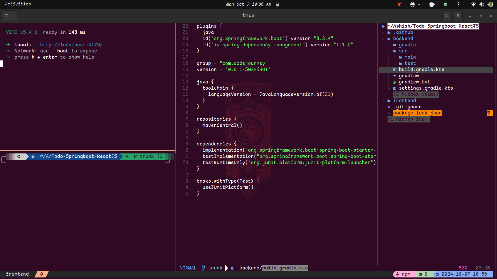

# <div align="center">

# Launchpad

<p>
  
  
  
  
</p>
<h3>Elevate Your Coding Journey! 🚀💻</h3>

<figure>
  
  <figcaption>Launchpad: Transforming Ideas into Code</figcaption>
</figure>

</div>

Launchpad is a powerful `<tool/framework/library>` designed to help `<target_audience>` `<primary_action>` efficiently and effectively.

## ✨ Key Features

- Feature 1: Brief description
- Feature 2: Brief description
- Feature 3: Brief description

## 🛠️ Installation

```bash
git clone https://github.com/Ashish-CodeJourney/Launchpad.git
cd Launchpad
npm install  # or your preferred package manager
```

## 🚀 Quick Start

```bash
npm start  # or the appropriate command to run your project
```

## 📚 Usage

Here's a basic example of how to use Launchpad:

```javascript
const Launchpad = require('Launchpad');

// Your example code here
```

## 🌟 What's Next?

- [ ] Implement feature X
- [ ] Optimize performance for Y
- [ ] Add support for Z

## 🧠 Behind the Scenes

### 💡 Inspiration
Launchpad was born from the need to `<solve a specific problem or improve a process>`.

### 🏆 Challenges & Learnings
- Overcame `<specific challenge>` by `<solution>`
- Gained deeper understanding of `<technology/concept>`

### 🛠️ Tech Stack
- Language: [Your primary language]
- Framework: [If applicable]
- Tools: [List key tools used]

<hr>

<div align="center">
<strong>🌟 If Launchpad has been helpful, consider giving it a star! 🌟</strong><br><br>
<a href="https://github.com/Ashish-CodeJourney">More Projects</a> •
<a href="https://dev.to/codejourney">Blog</a> •
<a href="https://twitter.com/codejourney_">Twitter</a> •
<a href="https://linkedin.com/in/ashish-codejourney">LinkedIn</a>
</div>
